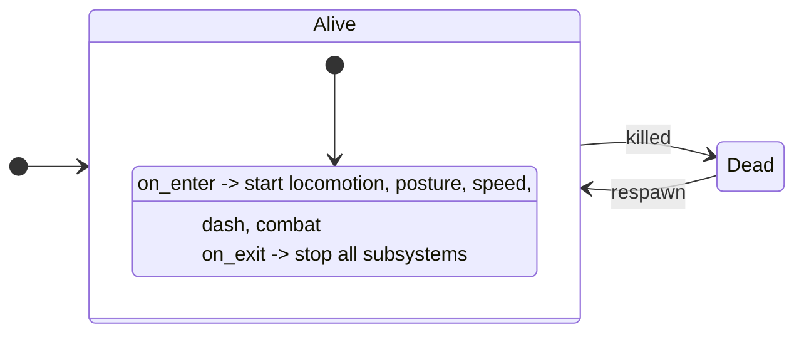
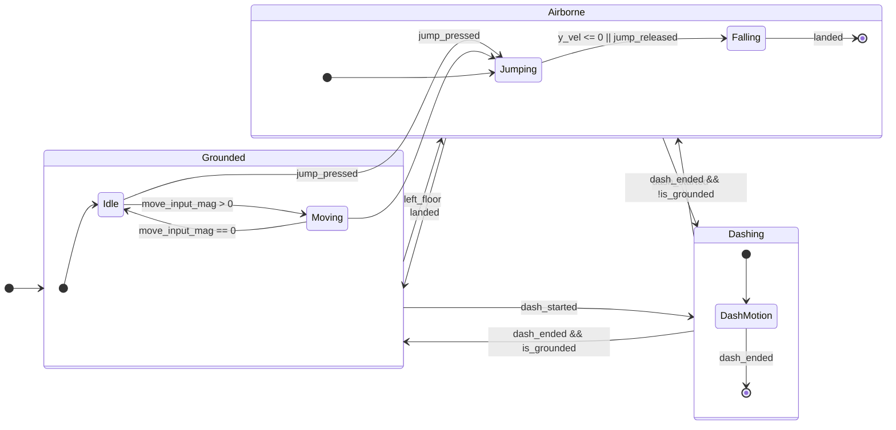
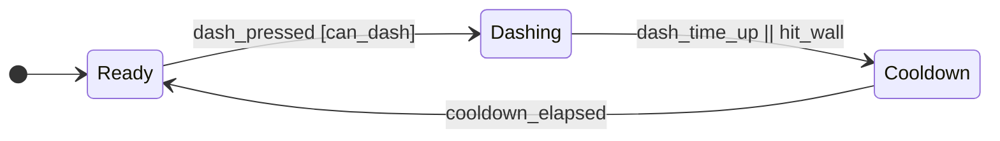
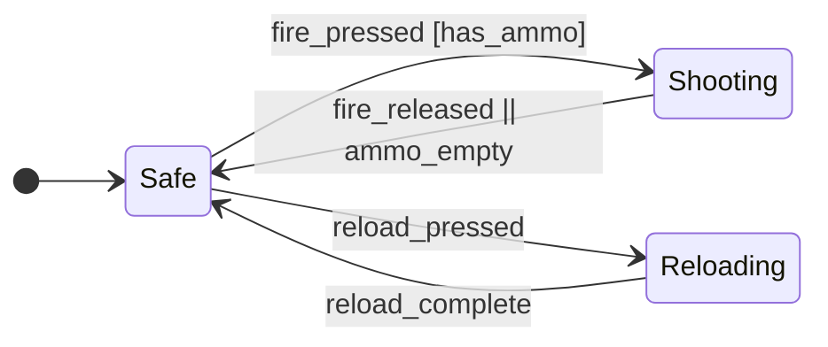

# Player State Machines (Godot + LogicBlocks)

This document outlines the state machine design for the player character in a first-person Godot game, utilizing the Chickensoft LogicBlocks library. The design employs a root logic block to manage parallel sub-logic blocks for different player functionalities, allowing for concurrent behaviors like locomotion, posture, speed, dashing, and combat.

## Overall Structure with LogicBlocks

The `PlayerRoot` logic block handles the top-level `Alive` and `Dead` states. When the player is `Alive`, it starts several independent sub-logic blocks that run in parallel. These sub-logic blocks communicate through strongly typed inputs and outputs, as per LogicBlocks' design principles.

### Player Root

This state machine manages the overall player status (alive or dead) and the lifecycle of the subordinate gameplay systems.



## Sub-Logic Blocks (Concurrent Systems)

Each of the following represents a separate `LogicBlock` instance running in parallel when the `PlayerRoot` is in the `Alive.SystemsActive` state. They communicate via event outputs and shared data (e.g., via a blackboard if applicable).

### Locomotion

This logic block handles the player's movement states, including being grounded, airborne, idle, moving, jumping, and falling. It also integrates a temporary `Dashing` override.



### Posture

This logic block manages the player's vertical stance, including `Standing`, `Crouching`, and `Sliding`. Guards indicate conditions that must be met for transitions.

```mermaid
stateDiagram-v2
  direction LR
  [*] --> Standing
  Standing --> Crouching: crouch_pressed
  Crouching --> Standing: crouch_released [ceiling_clear]

  Standing --> Sliding:
    crouch_pressed [is_sprinting && speed > slide_min &&
    slope_ok && !is_dashing]

  Sliding --> Crouching: slide_end [hold_crouch]
  Sliding --> Standing: slide_end [!hold_crouch && ceiling_clear]
```

### Speed

This logic block controls the player's horizontal movement speed, switching between `Walk` and `Sprint`. Conditions for sprinting include stamina, being grounded, and not crouching or dashing.

```mermaid
stateDiagram-v2
  direction LR
  [*] --> Walk

  Walk --> Sprint:
    sprint_pressed [stamina > 0 && is_grounded &&
    !is_crouching && !is_dashing]

  Sprint --> Walk:
    sprint_released || stamina_depleted || left_floor
```

### Dash

This logic block handles the player's dashing mechanic, including `Ready` to dash, actively `Dashing`, and a `Cooldown` period.



### Combat

This logic block manages the player's combat actions, specifically `Safe`, `Shooting`, and `Reloading`.



## Implementation Considerations with Chickensoft LogicBlocks

- **Parallelism**: LogicBlocks does not natively support "parallel regions" within a single state machine diagram. Instead, this design achieves concurrency by running multiple independent `LogicBlock` instances (one for each sub-system like Locomotion, Posture, etc.) managed by a parent `LogicBlock` (e.g., `PlayerRoot`).
- **Communication**: Sub-logic blocks will need to communicate. This is typically done by:
  - **Inputs/Outputs**: One logic block emits an `Output` (e.g., `DashLogicBlock` emits `dash_started`), and another subscribes to it as an `Input` (e.g., `LocomotionLogicBlock` consumes `dash_started`).
  - **Shared Context/Blackboard**: A common approach is to have a shared context object or "blackboard" where various logic blocks can read and write shared state variables (e.g., `is_grounded`, `is_crouching`, `current_speed_scalar`).
- **Guards**: Conditions shown in square brackets `[condition]` in the Mermaid diagrams represent "guards." In LogicBlocks, these translate to conditional logic within the `Input()` handler methods of your states.
- **Diagram Generation**: While these Mermaid diagrams are excellent for documentation, LogicBlocks includes tools to generate PlantUML diagrams directly from your C# code, which can help keep your code and diagrams synchronized. Consider using that feature as the source of truth for your diagrams once implemented.
